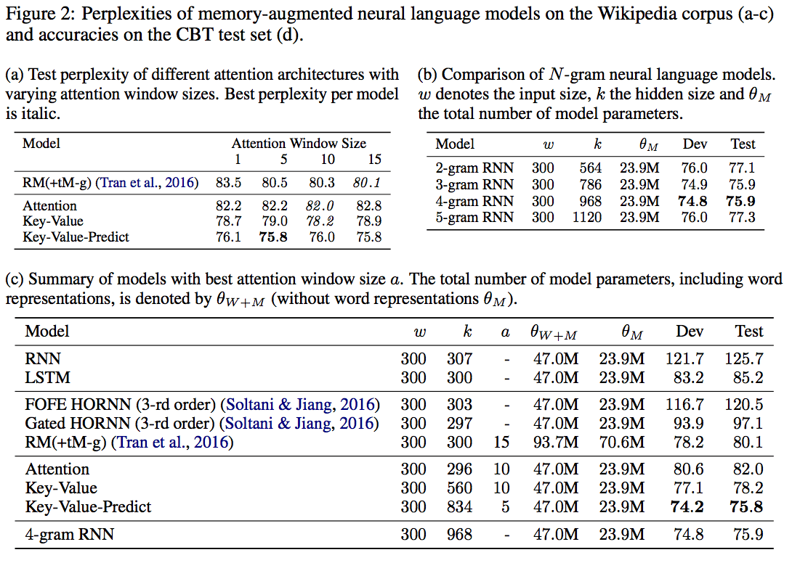

## 文献情報  
***
著者: M. Daniluk et al.  
所属: University College London  
出典: ICLR 2017 [(https://arxiv.org/abs/1702.04521)](https://arxiv.org/abs/1702.04521)  

## この論文の主張
***
1. ニューラル言語モデルのためのkey-valueに基づくAttentionを提案
2. さらにそれを改良したkey-value-predictに基づくAttentionの提案
3. 従来のMemory-augumented言語モデルよりも，パープレキシティが小さくなった

## 背景・関連研究
***
言語モデルは次に出現する単語を予測する能力を持っている．古典的なNグラムに基づく言語モデルは短文内での単語間の依存関係を捉えることができる．  
一方で，ニューラル言語モデルは，より広範囲な単語間の依存関係を捉えることができる．

近年のニューラル言語モデルはAttentionに基づくものが多く，より直接的に単語間の関係性を捉えられるようになってきている．

Attentionを言語モデルに取り入れるには，モデル中の出力ベクトルが以下の複数の役割を同時にこなさなければならない．
1. 次の単語を予測するためにある分布をエンコードする役割
2. attentionベクトルを計算するためのベクトルとして振る舞う役割
3. attentionにおいて文脈ベクトルを求めるために使われる役割->次のトークンを予測する際に文脈を考慮するのを助ける役割

一つの出力ベクトルに複数の役割を課すことは，モデルを複雑化させる要因となり，学習を難しくすると考えられる．  
したがって，本研究では，上記の三つの役割を別々のベクトルに割り当てることで，モデルを簡単化させることを目指す．  
具体的には，各時刻において出力されるベクトルを3つにするということである．  
論文内ではこれを，key-value-predictベクトルと名付けており，Attentionを含めて，key-value-predict Attentionと名付けている．

## 従来手法 (Attention for Neural Language Modeling)
***

(1) **時刻: $t$において，$L$個の出力ベクトルを記憶領域として取る**  

$$
\begin{equation*}
    Y_t = [{\bf h}_{t-L}, \dots, {\bf h}_{t-1}] \in \mathbb{R}^{k \times L}
\end{equation*}
$$  

ただし，$$k$$はLSTMの出力ベクトルの次元を指し，$h_t \in \mathbb{R}^k$は時刻: $t$における出力ベクトルを意味する．   

→ L個に限るのは実用的な問題から: Lはハイパーパラメータ

(2) **Attentionの重み: $\alpha_t$を計算する**

$$
\begin{equation*}
\begin{split}
\alpha_t &= {\rm softmax}(w^TM_t) \\
M_t &= {\rm tanh}(W^YY_t + (W^hh_t)1^T)
\end{split}
\end{equation*}
$$

ただし， $W^Y, W^h \in \mathbb{R}^{k \times k}, w \in \mathbb{R}^k$は学習パラメータである．また，$1 \in \mathbb{R}^L$である．  

→ ここでは時刻: $t$の出力ベクトル: $h_t$とそれ以前のL個の出力ベクトル: $Y_t$がどの程度関係しあっているかを求めている．  
つまりL個のトークンの各重要度を算出している．

(3) **Attentionベクトルを生成する**  
上記で算出したAttentionの重みを基に，Attentionベクトルを生成する．

$$
r_t = Y_t\alpha^T
$$

(4) **Attentionベクトルと元の出力ベクトルを結合する**  
Concatではなく，以下の式に基づいて非線形に結合する．

$$
h_t^* = {\rm tanh}(W^rr_t + W^xh_t)\\
$$

ただし，$W^r, W^x \in \mathbb{R}^{k \times k}$は学習パラメータである．

(5) **出力ベクトルを求める**

$$
y_t = {\rm softmax}(W^*h_t^* + b)
$$

ただし，$W^* \in \mathbb{R}^{\|V\| \times k}$であり，$b \in \mathbb{R}^{\|V\|}$である．  
ともに学習パラメータである．

## 提案手法
***
### Key-value attention
key-value Attentionでは，出力ベクトルをkeyとvalueに分割する．  
具体的には，時刻: $t$における出力ベクトルを以下のように定義し直す．  

$$
h_t = [k_t, v_t] \in \mathbb{R}^{2k}
$$

また，　$h_t$が関与する式を書き直すと，以下のようになる．

$$
\begin{split}
M_t &= {\rm tanh}(W^Y[k_{t-L}, \dots, k_{t-1}] + (W^hk_t)1^T) \\
r_t &= [v_{t-L}, \dots, v_{t-1}]\alpha^T \\
h_t^* &= {\rm tanh}(W^rr_t + W^xv_t)
\end{split}
$$

なお，上記以外の式は前章と同じである．  

→ ここで，$k$は検索キーとしての役割を果たしており，$v$はその中身のデータを表していると考えるとわかりやすいかもしれない．

### Key-value-predict attention
key-value attentionにおいても，valueが複数回使われていることがわかる．  
そこで，valueをさらに分割し，key-value-predict型のAttentionを考案した．  

→ keyはattentionの重みを計算するのにのみ用いられ，valueは文脈表現をエンコードするのに使われ，predictは次のトークンの分布をエンコードするのに用いられる．  
→ 完全分業制が達成されていることがわかる．  

$$
h_t = [k_t, v_t, p_t] \in \mathbb{R}^{3k}　\\
h_t^* = {\rm tanh}(W^rr_t + W^xp_t)
$$

## 実験結果
***
### 評価指標
#### パープレキシティ
参考: [http://www.jnlp.org/lab/graduates/okada/nlp/term/entropy](http://www.jnlp.org/lab/graduates/okada/nlp/term/entropy)  

パープレキシティ(perplexity)とは，言語モデルにおいてモデルの複雑性を評価するのに使われる指標である．   
パープレキシティは2のクロスエントロピー乗で定義され，一般に小さいほど良いモデルであるとされる．  

$$Perplexity = 2^{-\frac{1}{N}\sum_i^{N}\log P(w_i)}$$  

→ ここでの$P(w_i)$は言語モデルの単語出現確率を表している．  
→ パープレキシティは単語の分岐数を意味しており，ある単語に対してそれに続く単語の平均候補数も意味している．  

つまり，複雑なモデルであるほど，平均候補数が増加するため，パープレキシティは大きくなるといえる．

### 評価結果
提案手法： key-Value-Predictのパープレキシティが有意に小さいことがわかる．

(a)の図から，提案手法: key-value-predict attentionのおかげで，広範囲な文脈を考慮出来るようになっていることがわかる．  
(b)の図から，より広範な文脈を考慮したとしても，パープレキシティが大幅に改善することは期待できないということが読み取れる．

## 議論
***
Attentionを用いた言語モデルによって，従来手法よりもパープレキシティを改善することができた．  
しかし，あまりにも長い文脈を考慮することは，パープレキシティの改善には得策ではないこともわかった．

Future workとしては局所的な文脈の内容を考慮しないで，その背景にあるより大域的に関係する文脈を考慮できるような手法を考えることが挙げられる．

## 次に読むべき論文は？
***
Memory networksとか？  
→ key-valueの概念を初めて導入したらしい．
