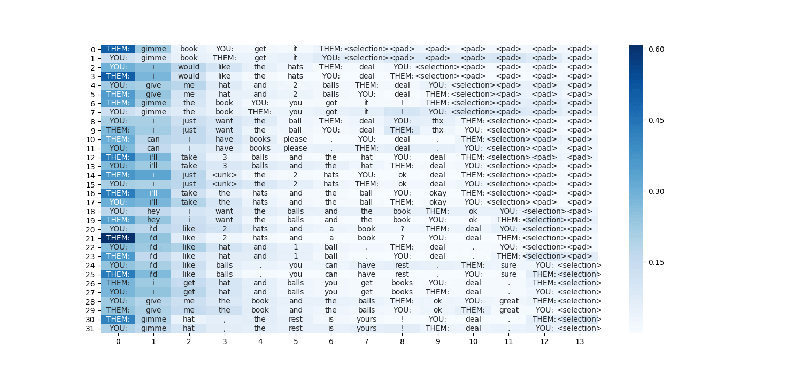

Pythonの可視化ライブラリであるseabornとグラフ描画ライブラリのMatplotlibを組み合わせることで，意外と簡単にSelf Attentionの重みを可視化することができる．

とあるデータセットを用いて実際に可視化した結果が以下の図です．



それでは，順を追って簡単に見ていきましょう．
なお，深層学習のフレームワークにはPyTorchを使用し，テキストデータの前処理にはtorchtextを使用しています．

## 1. ダウンロード & インストール
Matplotlib，seabornをインストールしていない場合は，インストールしましょう．
```
pip install matplotlib
pip install seaborn
```

## 2. インポート
本稿ではサーバー上で動作させることを想定しているので，前もって`mpl.use('Agg')`を指定することで，描画エラーを回避します．
```
import matplotlib as mpl
mpl.use('Agg')
import matplotlib.pyplot as plt
import seaborn as sns
import numpy as np
```

## 3. Self Attentionの実装
Self Attentionの実装については，[GitHub](https://github.com/gucci-j/imdb-classification-gru)にあげている，ソースコード: `model_with_self_attention.py`を流用しました．クラス部分を以下に貼ります．

```
class Self_Attention(nn.Module):
    def __init__(self, query_dim):
        # assume: query_dim = key/value_dim
        super(Self_Attention, self).__init__()
        self.scale = 1. / math.sqrt(query_dim)

    def forward(self, query, key, value):
        # query == hidden: (batch_size, hidden_dim * 2)
        # key/value == gru_output: (sentence_length, batch_size, hidden_dim * 2)
        query = query.unsqueeze(1) # (batch_size, 1, hidden_dim * 2)
        key = key.transpose(0, 1).transpose(1, 2) # (batch_size, hidden_dim * 2, sentence_length)

        # bmm: batch matrix-matrix multiplication
        attention_weight = torch.bmm(query, key) # (batch_size, 1, sentence_length)
        attention_weight = F.softmax(attention_weight.mul_(self.scale), dim=2) # normalize sentence_length's dimension

        value = value.transpose(0, 1) # (batch_size, sentence_length, hidden_dim * 2)
        attention_output = torch.bmm(attention_weight, value) # (batch_size, 1, hidden_dim * 2)
        attention_output = attention_output.squeeze(1) # (batch_size, hidden_dim * 2)

        return attention_output, attention_weight.squeeze(1)
```

ソースコード中において，`attention_weight`は時系列方向に正規化された重みベクトルとなっています．そのため，このベクトルを可視化することで，各時刻における入力の単語の重要度を可視化できることになります．  
要するに，このソースコードにおいては，可視化には`attention_weight`のみを用いれば良いことになります．

## 4. いざ描画

ヒートマップの描画には，`sns.heatmap()`を使います．詳しい使い方は，[ドキュメント](https://seaborn.pydata.org/generated/seaborn.heatmap.html)をご覧ください．

重要な点としては，ヒートマップ中の各セル内に入力の単語を表示させたいときに，`annot`に`string`型のリストを渡すことで，描画できてしまうということです！

ただし，必ず**リストをNumPyに通すこと** + **`fmt=''`**を指定するのを忘れないでください！

```
plt.figure(figsize = (15, 7))
sns.heatmap(attention_weight, annot=np.asarray(itos), fmt='', cmap='Blues')
plt.savefig('./fig/attention_' + str(batch_count) + '.png')
plt.close()
```

## ソースコード
ソースコードは後日: [GitHub](https://github.com/gucci-j/imdb-classification-gru)に追加して公開する予定です．