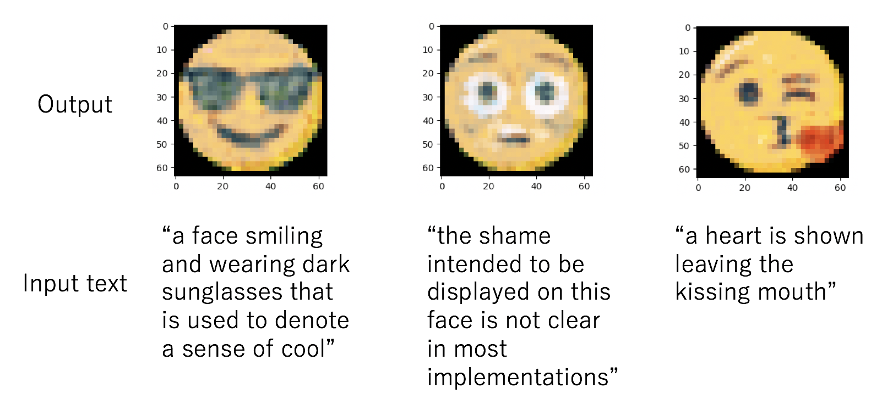
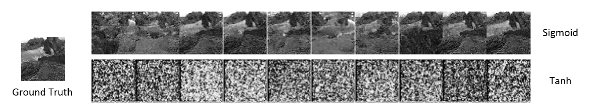

# Atsuki Yamaguchi

[Github](https://github.com/gucci-j), 
Email: y-atsuki[at]st.go.tuat.ac.jp

## Currently

I'm an undergraduate student at [Tokyo University of Agriculture and Technology](http://www.tuat.ac.jp/en/), majoring in Computer and Information Sciences.

## Research interests

Machine Learning, Generative Models, Natural Language Processing

### Recent Work

1. __Generating Emojis with generative models and word embedding__  
This research aims at generating emojis based on input texts. 

     

2. __Generative model based frame generation of volcanic flow video__  
This research aims at simulating lava flow by utilizing generative models.

    

## Education

`April 2015 - now`
__Tokyo University of Agriculture and Technology, *Tokyo, Japan*__ 

- B.E. in Computer and Information Sciences
- Degree expected in March 2019
- GPA: 3.63 / 4.00, Earned 162 credits (128 credits are required for graduation)

`September 2017 - February 2018`
__De La Salle University, *Manila, Philippines*__

- Exchange Semester at Electronics and Communications Engineering
- GPA: 2.82 / 4.00, Earned 14 credits

## Awards & Scholarships

`August 2016 - now` __Kawamura Foundation Scholarship__

- Sponsored by: Kawamura Scholarship Foundation
- Competition rate: five students were nominated from 46 selected universities in Japan.

`April 2016 - now` __Outstanding Student Scholarship__

- Sponsored by: Tokyo University of Agriculture and Technology
- Competition rate: the top few percent of students were nominated based on GPA.

`Fall 2017` __JASSO Student Exchange Support Program__

- Sponsored by: Japan Student Services Organization (JASSO)
- Competition rate: not yet public

## Publications
### International conference, Oral
* **A. Yamaguchi**, and M. Cabatuan, "Generative model based frame generation of volcanic flow video," In proceedings of 2017 IEEE 9th International Conference on Humanoid, Nanotechnology, Information Technology, Communication and Control, Environment and Management.

<!-- ### Footer
Last updated: July 2018 -->
